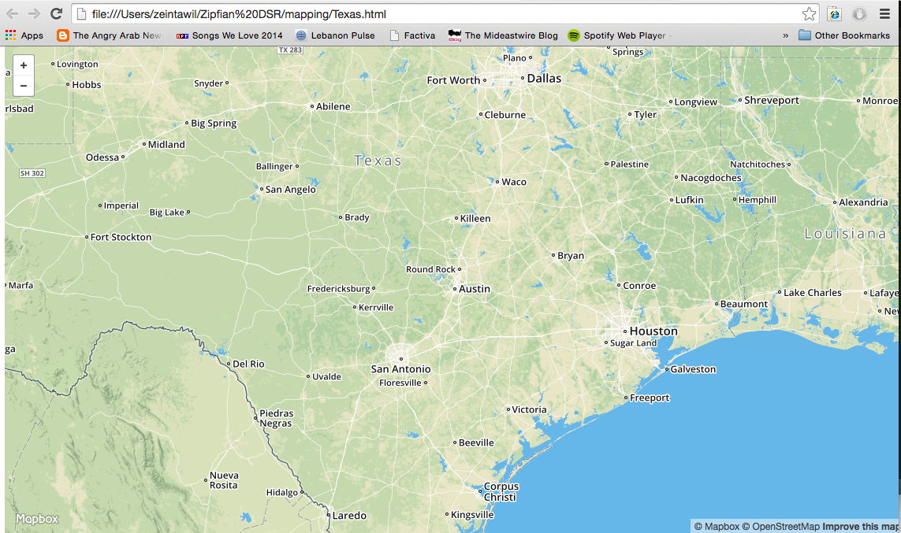

# Mapping

## Data  
You'll primarily work with data in **GeoJSON** or **shapefiles** (.shp).  G


## Easy Mapping with CartoDB
Create a free account with [CartoDB](cartodb.com) 

CartoDB is great way to get a quick look of your geographic data.  They have a great API and SQL interface that lets you control your map from your own web app.

Create a new dataset, drop the SF_Public_Schools.zip dataset in, and create a map.  Just like that, you have a new map.  

## A little More Work
If you want to host the data yourself, it will take a little more work--but not *that* much.

### PostgreSQL

#### Install PostGIS
You'll want to install the GIS extension for PostgreSQL.  This will allow you to load .shp files and then export GeoJSON strings.

Install PostGIS with Brew:
```
brew install postgis
```

#### Initializing a Database
Whenever you want to enbale a Postgres database to have GIS capabilities, you'll have to use the following pattern:

```sql
CREATE DATABASE <dbname>;
\q
```

```sql
psql <dbname>
CREATE EXTENSION POSTGIS
```

Now you have a whole bunch of GIS [capabilities](http://postgis.net/docs/manual-2.1/reference.html).

#### Inserting Shape Files
You can insert shape files into your database from the command line using the following pattern:

```
ogr2ogr -f "PostgreSQL" PG:"dbname= <dbname> user=<your psql username>" "<path to shapefile>/<shape file>" -nlt PROMOTE_TO_MULTI -nln <table name> -append
```
*Note* The table  doesn't have to yet be created.  If it isn't already created, it will be created along with all the GIS dependencies.  

#### Creating GeoJSON
If you want to show maps in your web app, you'll likely be using CartoDB or Mapbox.  Mapbox will need the data in GeoJSON format.  You can do this with your GIS enabled DB:

```sql
SELECT 
DISTINCT
ST_asGEOJSON(wkb_geometry) geometry
FROM table
```

### Mapbox
[Mapbox](http://www.mapbox.com) is a JS library built on top of [Leaflet.js](http://www.leafletjs.com).  If there's ever something you want to do in a map, they should be your starting point when Googling, "How do I ....?"  

To use them, you will need to call them in your HTML web app template.  

In the head of the HTML template, import both libraries and set the position in a style.
```html
	
	<head>
	...

	<script src='https://api.tiles.mapbox.com/mapbox.js/v2.1.9/mapbox.js'></script>
	<link href='https://api.tiles.mapbox.com/mapbox.js/v2.1.9/mapbox.css' rel='stylesheet' />

	<style type="text/css">
	  #map { position:absolute; top:0; bottom:0; width:100%; }
	</style>
	...
	</head> 

	```

You then intitialize a map and center it around the point of interest:

```javascript

	<script>

		<div id='map'></div>

		// Initialize the map to go to Texas
		L.mapbox.accessToken = '<your API key';
		var map = L.mapbox.map('map', 'mapbox.streets')
		    .setView([30.25, -97.75], 7);
	....
	</script>
```




You can add a layer to your map as a layer object.  Here we are also using Jinga2 to pass in the geoJSON of the layer we want to show.

```javascript
	<div id='map'></div>
	<script type="text/javascript">
		L.mapbox.accessToken = 'pk.eyJ1IjoienRhd2lsIiwiYSI6ImUwMWI3YzU0NGEzMzhhMWIxY2ExYmViYTdmZjkyYTE5In0.WPudfWdQ917jhqHC1om0Ag';
		var map = L.mapbox.map('map', 'mapbox.streets')
		    .setView([30.25, -97.75], 7);
	
	geo_json_variable = {{ cong_113 | safe}} 

	layer = L.geoJson(geo_json_variable, {
						    style: function(feature) {
						    	return {fillColor: feature.properties.hexcolor, weight: line_width, fillOpacity: fillOpacity};
								    				}
						}).addTo(map);})

	</script>
```

If we go to my_app.py, we see the below Flask app.  cong_113 is a GeoJSON shape file.  We will now look through the scripts to plot the shape.

```python

@app.route('/')
def map():
    ## Have the home page be a place to input a file or paste the lat/long (address if ambitious)
    return render_template("Texas.html", cong_113 = cong_113)

if __name__ == '__main__':
    app.run(host='127.0.0.1', port=6969, debug=True)

```